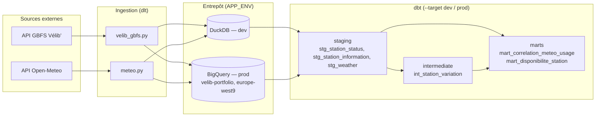
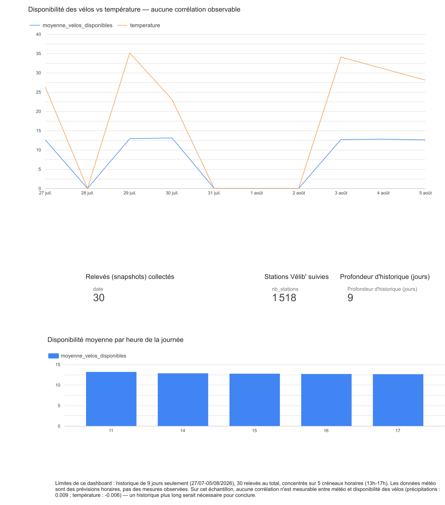

# data-engineering-portfolio

[](https://github.com/williamkdata/data-engineering-portfolio/actions/workflows/ci.yml)

Pipeline data engineering "walking skeleton" sur les données open data Vélib' Métropole (GBFS) et la météo Open-Meteo : dlt → DuckDB (dev) / BigQuery (prod) → dbt → marts, orchestré par Airflow (local, Docker Compose), infrastructure GCP gérée par Terraform, CI GitHub Actions (tests + validation dbt).

## Architecture



Même code d'ingestion et mêmes modèles dbt pour les deux entrepôts — seule la configuration change (`APP_ENV` côté `dlt`, `--target` côté `dbt`).

## M1 — Ingestion GBFS Vélib' → DuckDB

Récupère les données GBFS (sans clé API) et les charge dans `data/velib.duckdb` :

- `station_information` (photo courante des stations : id, nom, lat/lon, capacité) — rechargée entièrement à chaque run.
- `station_status` (disponibilité temps réel : vélos/docks disponibles, statut) — accumulée à chaque run avec un timestamp d'ingestion, pour construire un historique.

Les URLs des flux sont déduites dynamiquement du document de découverte GBFS (`gbfs.json`), pas codées en dur.

Lancer l'ingestion :

```bash
uv run python ingestion/velib_gbfs.py
```

Chaque run affiche le nombre de stations, le total de vélos disponibles pour ce run, et le nombre de lignes cumulées dans l'historique `station_status`. Relancer le script plusieurs fois (ex. toutes les quelques minutes) fait grossir l'historique sans écraser les stations.

## M2 — Source météo (Open-Meteo)

Deuxième source du projet, pour pouvoir à terme croiser météo et disponibilité des vélos ("la météo influence-t-elle l'usage du Vélib' ?"). Récupère les prévisions horaires (température, vent, précipitations) pour Paris via l'API Open-Meteo (sans clé), et les charge dans le même fichier `data/velib.duckdb`, dans un dataset dédié `meteo_raw`.

Lancer l'ingestion :

```bash
uv run python ingestion/meteo.py
```

**Choix de design (et pourquoi) :**

- **Prévision (`/v1/forecast`), assumée comme telle — pas de la météo constatée.** Open-Meteo confirme dans sa doc que même `past_days` et `current` restent des sorties de modèle, jamais une mesure réelle (station météo, satellite). L'alternative sérieuse était l'API Historical Weather (`/v1/archive`, réanalyse ERA5/ERA5-Land), qui consolide de vraies observations mais avec ~5 jours de délai — inutilisable pour corréler avec des snapshots Vélib' récents. Décision retenue : garder la prévision, parce que l'objectif analytique du projet ("la météo influence-t-elle l'usage du Vélib'") s'intéresse autant à la météo que les gens **anticipent** avant de sortir qu'à celle réellement constatée — une prévision consultée est un signal comportemental légitime, pas seulement un proxy imparfait de la réalité. Limite assumée : ce n'est pas une source de vérité météorologique, à ne pas confondre avec une étude climatique.
- **`write_disposition="append"` + colonne `ingested_at`** (et non `merge`). Une même heure est une sortie de modèle **recalculée** à chaque appel (donc potentiellement différente d'un run à l'autre) — `merge` écraserait silencieusement une prévision par la suivante, perdant toute trace de son évolution. `append` avec un timestamp d'ingestion (même pattern que `station_status`) construit à la place un historique des prévisions successives pour une même heure — on peut reconstituer "ce que le modèle prédisait pour 14h, tel que capté le 29/07" vs "tel que capté le 30/07". Pas de `primary_key` : plusieurs lignes légitimes partagent désormais le même `time`.
- **Ingestion brute, alignement plus tard.** Le rapprochement horaire avec `station_status` (arrondi à l'heure via `date_trunc`) se fait en aval (SQL exploratoire aujourd'hui, dbt en Phase 3) — cohérent avec une logique ELT : la donnée brute reste la source de vérité, jamais retapée à l'API pour corriger un alignement.
- **Dataset séparé (`meteo_raw` vs `velib_raw`)**, un fichier par source (`meteo.py` vs `velib_gbfs.py`) — même principe de séparation par fonctionnalité. Un dataset distinct n'empêche pas les jointures : `velib_raw.station_status` et `meteo_raw.weather` se croisent normalement en qualifiant les tables.
- **Transformation des tableaux parallèles.** L'API Open-Meteo renvoie ses variables horaires en tableaux parallèles (`hourly.time`, `hourly.temperature_2m`, ...), pas en liste d'objets — reconstruits en une liste de dicts (une ligne par heure) via `zip()`.

**Couverture temporelle — corrigée et mesurée.** Sans `past_days`, la fenêtre météo était une fenêtre glissante (aujourd'hui + 7 jours) alors que l'historique Vélib' s'accumule et vieillit : seulement ~7% des lignes `station_status` trouvaient une météo correspondante (1518/21252). Fix : `past_days=4` sur l'appel Open-Meteo — cohérent avec la décision ci-dessus (on reste sur de la donnée modèle/prévisionnelle, juste sur une fenêtre plus large en arrière, pas un compromis vers de l'observation réelle). Résultat mesuré après le fix : **100% de couverture** (22770/22770 lignes `station_status` trouvent une météo à l'heure correspondante, via une jointure par existence `EXISTS`).

## Phase 3 — Transformation avec dbt

dbt transforme la donnée brute (chargée par `dlt`) **dans** DuckDB — aucun déplacement de données, juste du SQL exécuté sur place et matérialisé en vue/table (ELT, par opposition à l'ETL classique). Choix de version : `dbt-core` (ligne classique 1.x) + `dbt-duckdb`, pas la nouvelle génération Fusion/dbt 2.0 (alpha/bêta mi-2026, support DuckDB encore bêta) — priorité à la stabilité en dev local.

Configuration : `dbt/dbt_project.yml` (versionné) + `~/.dbt/profiles.yml` (hors repo, pointe vers `data/velib.duckdb`).

Lancer :

```bash
uv run dbt run --project-dir dbt      # construit tous les modèles
uv run dbt test --project-dir dbt     # exécute les tests de données
uv run dbt docs generate --project-dir dbt && uv run dbt docs serve --project-dir dbt  # DAG visuel
```

**Architecture en couches :**
- **staging** (`stg_*`, vues) : un modèle par table source, renommage léger, colonnes explicites. `stg_station_status` calcule `snapshot_hour` (`date_trunc('hour', ingested_at)`), nécessaire à toute jointure horaire en aval.
- **intermediate** (`int_station_variation`) : la variation de vélos par station entre deux snapshots (`LAG`, logique réutilisée d'une session SQL antérieure), avec `ingested_at` en second critère de tri — nécessaire car plusieurs ingestions peuvent tomber dans la même heure arrondie (égalités réelles mesurées sur les données).
- **marts** (tables) :
  - `mart_correlation_meteo_usage` : le mart phare. `LEFT JOIN` depuis `stg_station_status` (jamais `INNER`, pour ne pas perdre de lignes Vélib' silencieusement). La météo est dédupliquée à 1 ligne/heure avant la jointure (`ROW_NUMBER` + `QUALIFY`, la prévision la plus ancienne captée pour cette heure — cohérente avec la décision "les gens réagissent à la prévision vue avant de sortir"). Clé de substitution `station_snapshot_id` basée sur `ingested_at` (pas `snapshot_hour` : le vrai grain de ce mart est "une station, un run d'ingestion précis", découvert via un test d'unicité qui échouait sur la clé composite naïve).
  - `mart_disponibilite_station` : agrégats simples (moyennes/max de vélos et docks disponibles) par station et par heure.

**Tests dbt** (nature différente des tests `pytest` : ceux-ci vérifient la **donnée** dans l'entrepôt, pas le code) :
- Génériques (YAML) : `not_null` + `unique` sur `station_snapshot_id`, `relationships` (intégrité référentielle) entre `mart_disponibilite_station.station_id` et `stg_station_information.station_id`.
- Singulier (`tests/assert_bikes_available_coherent.sql`) : `num_bikes_available` ne doit être ni négatif ni supérieur à `capacity`. Résultat réel : **86 violations**, uniquement des dépassements de capacité (jamais de négatif) — phénomène réel des systèmes de vélos en libre-service (rééquilibrage, usagers qui reposent un vélo sur une station "pleine"), pas un bug de pipeline. Configuré en `severity='warn'` : informatif, non bloquant, mais documenté comme cas réel du terrain.

## Tests

```bash
uv add --dev pytest    # déjà fait, dépendance de dev uniquement
uv run pytest -v
```

`pytest` (dépendance de dev, jamais nécessaire en production) découvre automatiquement les fichiers `tests/test_*.py`. Le chemin `ingestion/` est ajouté au `pythonpath` via `[tool.pytest.ini_options]` dans `pyproject.toml`, pour que les tests puissent importer les modules d'ingestion directement (mêmes imports "voisins" qu'entre `meteo.py` et `http_util.py`).

Couverture actuelle (`tests/test_meteo.py`) :

- **Logique pure** (`parse_hourly_weather_data`) : reconstruction des tableaux parallèles Open-Meteo en liste de dicts, sur des données factices — aucun appel réseau.
- **Cas limite** : `zip()` tronque silencieusement à la plus courte liste si les tableaux parallèles ont des longueurs différentes (comportement réel de Python, pas une supposition) — documenté par un test dédié.
- **Mock de `fetch_json`** (fixture `monkeypatch`) : teste `get_weather()` (la resource `dlt` complète, avec l'ajout de `ingested_at`) sans jamais appeler Open-Meteo — rapide, déterministe, fonctionne hors-ligne. Ce test aurait détecté le bug corrigé en Partie 1 (`ingested_at` mal assigné) ; le test sur la logique pure seule ne l'aurait pas fait, puisqu'il ne couvre pas `get_weather`.

Volontairement pas de test d'intégration (vraie base DuckDB, vrai appel réseau) à ce stade : la logique pure et le mock couvrent l'essentiel du risque, pour un coût de maintenance bien plus faible.

## Phase 2 — Migration BigQuery (terminée)

Migration du pipeline de DuckDB local vers BigQuery/GCP, projet dédié `velib-portfolio`.

**Sécurité de l'historique météo** : `past_days` relevé de 4 à **92** (le maximum autorisé par Open-Meteo) — `past_days=4` créait un risque de trou définitif dans l'historique si le pipeline ne tournait pas pendant plus de 4 jours (l'API forecast ne rattrape jamais le passé au-delà de sa fenêtre glissante au moment de l'appel).

**Setup GCP** : projet dédié (isolation facturation/quotas/suppression), région **`europe-west9`** (Paris — donnée jamais hors de France, argument RGPD/latence explicite plutôt que EU multi-région). Facturation activée + alerte de budget (non bloquante, juste informative). Authentification locale via **Application Default Credentials** (`gcloud auth application-default login`) — pas de clé JSON de compte de service, rien à protéger dans le repo.

**Ingestion `dlt` paramétrable dev/prod** : une variable d'environnement `APP_ENV` (`duckdb` par défaut, `bigquery` sinon) choisit la destination sans dupliquer la logique des resources — `fetch_json`, `zip()`, `yield` restent identiques, seule la configuration du pipeline change (`get_destination()` dans `http_util.py`, partagée par `velib_gbfs.py` et `meteo.py`). Preuve concrète de l'agnosticisme de destination de `dlt` : les mêmes tables enfant générées pour les champs imbriqués (`station_status__num_bikes_available_types`, `station_information__rental_methods`) apparaissent à l'identique sur BigQuery.

Lancer en BigQuery :

```bash
$env:APP_ENV = "bigquery"
uv run python ingestion/velib_gbfs.py
uv run python ingestion/meteo.py
```

Typage vérifié en sortie : `time`/`ingested_at` bien en `TIMESTAMP` (pas `DATETIME`) — `dlt` infère correctement le type à partir des chaînes ISO8601 avec fuseau horaire.

**Fait à retenir sur la facturation** : une requête de contrôle qui ne scanne que 18,6 Ko a été facturée **10 Mio** — BigQuery applique un minimum de facturation de 10 Mio par requête, quel que soit le volume réellement scanné. Négligeable au vu du free tier (1 TiB/mois), mais un vrai réflexe de lecture de facture à avoir.

### Migration dbt — cibles multiples `dev`/`prod`

`~/.dbt/profiles.yml` déclare deux `outputs` sous le même profil : `dev` (DuckDB, comme avant) et `prod` (BigQuery, `method: oauth` via l'ADC déjà configuré, `location: europe-west9`, `maximum_bytes_billed: 1073741824` — 1 Gio, le garde-fou qui rejette une requête avant exécution si elle dépasserait ce volume). Noms choisis volontairement neutres (environnement, pas fournisseur) : le code ne doit pas savoir qu'un jour `prod` pourrait pointer vers autre chose que BigQuery.

```bash
uv run dbt run --target prod --project-dir dbt
uv run dbt test --target prod --project-dir dbt
```

**Portabilité SQL — incompatibilités réelles rencontrées et corrigées** (via des conditions Jinja `{{ ... if target.name == 'dev' else ... }}`, pour que le même fichier `.sql` génère la syntaxe adaptée à la cible active) :
- `database:` des sources (`sources.yml`) : codé en dur sur `velib` (le nom interne du fichier `.duckdb`), sans aucun sens sur BigQuery où `database` désigne le projet GCP (`velib-portfolio`).
- `date_trunc('hour', ts)` (DuckDB) vs `TIMESTAMP_TRUNC(ts, HOUR)` (BigQuery) : nom de fonction différent, ordre des arguments inversé, date part sans guillemets côté BigQuery.
- `CAST(... AS VARCHAR)` (DuckDB) vs `CAST(... AS STRING)` (BigQuery) : même besoin, nom de type différent.

**Résultat** : `dbt run`/`dbt test` passent au vert sur `dev` **et** `prod`, sans aucune duplication de modèle — un seul jeu de fichiers `.sql`, deux entrepôts cibles.

### Partitionnement, clustering et mesure du coût réel

`mart_correlation_meteo_usage` (BigQuery uniquement, config conditionnée par ``) :

```sql
{{ config(
    partition_by={"field": "ingested_at", "data_type": "timestamp", "granularity": "day"},
    cluster_by=["station_id"]
) }}
```

- **Partitionné par jour sur `ingested_at`** : les requêtes filtrées par date (le cas d'usage principal — "l'usage d'aujourd'hui", "la semaine dernière") ne lisent que les partitions concernées, pas la table entière.
- **Clusterisé par `station_id`** : à l'intérieur d'une partition, les lignes d'une même station sont stockées à proximité — utile pour l'analyse par station sur une journée donnée.

**Trois mesures réelles** (dry run, avant toute exécution facturée), sur un historique backfillé depuis DuckDB pour un volume représentatif (33 400 lignes) :

| Comparaison | Octets traités | Réduction |
|---|---|---|
| Sans partitionnement | 1 068 672 | — |
| Avec partitionnement (même requête, filtrée par jour) | 291 456 | **~73%** |
| `SELECT *` (toutes colonnes) | 737 106 | — |
| Colonnes explicites (3/6) | 291 456 | **~60%** |

**Conversion en coût, et une nuance honnête à connaître** : au tarif on-demand (6,25 $/TiB), ces volumes représentent $0,000001 à $0,000006 — négligeable. Mais BigQuery applique un **minimum de facturation de 10 Mio par requête** (déjà repéré en Partie 2) : à ce volume de test, ce plancher (10 485 760 octets, $0,00006) est **supérieur** à toutes les requêtes mesurées — les optimisations ne changent donc rien à la facture réelle à cette échelle. Ce qui reste pertinent : la **réduction en pourcentage d'octets traités** (73%, 60%) est le signal qui compte — sur une table de production dépassant ce plancher, le même pourcentage se traduit directement en économies réelles.

Vérification de la config appliquée (metadata BigQuery, pas juste acceptée syntaxiquement) :
```
Partitioning: TimePartitioning(field='ingested_at', type_='DAY')
Clustering: ['station_id']
```

## Phase 4 — Orchestration (Airflow, Terraform, CI)

### Pourquoi orchestrer — justification métier, pas décorative

Open-Meteo (`/v1/forecast`) n'expose qu'une **fenêtre glissante** de `past_days=92` : à chaque appel, l'API ne remonte que 92 jours en arrière, jamais plus. Si le pipeline ne tourne pas pendant plus de 92 jours, le trou dans l'historique météo devient **définitif et irrécupérable** — impossible de rejouer le passé au-delà de cette fenêtre. L'orchestration répond donc à une contrainte de fraîcheur mesurable, pas à "montrer qu'on sait utiliser Airflow".

### Airflow en local (Docker Compose)

Airflow 3.3.0 via le quickstart officiel Docker Compose, avec un `Dockerfile` qui étend l'image officielle (`dlt`, `duckdb`, `dbt-core`, `dbt-bigquery`, `dbt-duckdb` — absents de l'image de base) et des montages supplémentaires pour `ingestion/`, `dbt/`, `data/`.

Plusieurs containers séparés, chacun un rôle précis — l'équivalent éclaté de ce qu'un TAC (Talend Administration Center) fait dans une seule interface :
- **scheduler** : décide QUAND une tâche démarre, ne l'exécute jamais lui-même.
- **dag-processor** : lit les fichiers `.py` de `dags/` et les transforme en DAGs utilisables.
- **worker** : exécute réellement le travail (lance les scripts, `dbt run`/`dbt test`).
- **apiserver** : sert l'interface web.
- **postgres** : base de métadonnées (DAGs, runs, statuts).
- **redis** : file d'attente entre le scheduler et les workers.

Différence structurelle avec TAC : dans TAC, la planification se configure par des clics dans une interface. Dans Airflow, elle est **déclarée en code Python**, versionnable et reviewable comme n'importe quel fichier du repo.

### Stratégie de credentials — compte de service dédié

Un container Airflow tourne sans supervision : impossible d'utiliser l'authentification interactive (ADC utilisateur) qui fonctionne en local. Un **compte de service** dédié (`airflow-velib@velib-portfolio.iam.gserviceaccount.com`) porte à la place les droits nécessaires, au **moindre privilège** : `roles/bigquery.jobUser` (niveau projet, lancer des requêtes) + `roles/bigquery.dataEditor` (niveau dataset, sur `velib_raw`, `meteo_raw`, `velib_analytics`) — jamais un rôle large type Editor/Admin.

La clé JSON du compte de service vit dans `secrets/` (gitignoré, jamais commis), montée en lecture seule dans les containers. Une clé Fernet (dans `.env`, gitignoré) chiffre les champs sensibles que Airflow pourrait stocker en base.

Le target dbt `prod` (déjà utilisé en Phase 2 pour BigQuery) bascule automatiquement sa méthode d'authentification selon le contexte, sans créer de 3ᵉ target :

```yaml
method: "{{ 'service-account' if env_var('DBT_GCP_KEYFILE', '') else 'oauth' }}"
keyfile: "{{ env_var('DBT_GCP_KEYFILE', '') }}"
```

`oauth`/ADC en local (rien défini), `service-account` dans les containers (`DBT_GCP_KEYFILE` pointe vers la clé). Même fichier `dbt/profiles/profiles.yml`, commis (aucun secret dedans — juste un chemin vers un fichier lui-même gitignoré), réutilisé à l'identique pour Airflow **et** la CI (voir plus bas).

### Le DAG

```
[ingest_velib, ingest_meteo] >> dbt_run >> dbt_test
```

- **Parallèle, pas séquentiel** pour les deux ingestions : aucune dépendance de données entre les deux sources.
- **`BashOperator`** pour les 4 tâches (pas `PythonOperator`) : reproduit exactement l'usage CLI manuel déjà en place, isolation par sous-processus, `dbt` n'est de toute façon pas une fonction Python importable.
- **`schedule="0 * * * *"`** (horaire) : aligné sur le grain déjà présent dans les modèles (`snapshot_hour`, tronqué à l'heure) et sur la résolution horaire d'Open-Meteo.
- **`catchup=False`** : ce pipeline capture un état courant, rejouer les créneaux manqués n'a pas de sens métier.
- **`retries=2`, `retry_delay=5min`** : absorbe les pannes transitoires (API externe, réseau) sans intervention manuelle.
- **`max_active_runs=1`** — voir le retour d'expérience ci-dessous, ce n'est pas une précaution théorique.

Note technique : `env=` sur un `BashOperator` **remplace tout l'environnement du sous-processus** (y compris `PATH`) sauf si `append_env=True` est explicitement précisé — sans ça, `python`/`dbt` deviennent introuvables dans le sous-processus.

### Idempotence et exécutions concurrentes

En testant, plusieurs déclenchements manuels rapprochés ont fait tourner **3 dag runs simultanément** (confirmé via `airflow dags list-runs`, tous à l'état `running` en même temps). Deux exécutions concurrentes de `ingest_velib` ont chacune fait un `APPEND` dans la même table BigQuery au même moment → **1518 lignes dupliquées** (chaque station présente deux fois, avec le même `ingested_at`). Détecté immédiatement par le test dbt `unique` sur `station_snapshot_id` — exactement son rôle. Diagnostiqué par élimination (API GBFS propre → pipeline `dlt` isolé propre → seule l'exécution concurrente via Airflow dupliquait), corrigé par `max_active_runs=1`, données nettoyées, mart reconstruit, tests repassés au vert, puis un run complet sans intervention manuelle confirmé.

**La nuance importante** : `max_active_runs=1` **sérialise** l'exécution — il empêche deux runs de tourner en même temps. Ce n'est **pas** la même chose qu'une **écriture idempotente**. L'écriture reste un `APPEND` : si une tâche échoue en cours de route et qu'Airflow la retente, chaque tentative génère un nouveau `ingested_at` et ajoute une nouvelle ligne — ce n'est pas un doublon strict (deux lignes identiques), mais ce n'est pas non plus une opération qu'on peut rejouer sans aucun effet. La vraie réponse architecturale à une idempotence stricte serait une **écriture rejouable** : soit un `merge` sur une clé stable (station_id + intervalle planifié, via le `logical_date` plutôt que `datetime.now()`), soit un `delete`+`insert` ciblé sur la partition concernée avant d'écrire. Aucune des deux n'est implémentée ici — complexité volontairement non ajoutée pour ce projet, un compromis assumé et documenté plutôt qu'ignoré.

### Terraform minimal — les ressources GCP existantes

Périmètre strict : les 3 datasets BigQuery, le compte de service `airflow-velib` et ses 4 attributions IAM, tous créés à la main en amont. Objectif assumé : documenter l'infra comme du code plutôt que devenir expert IaC.

Point pédagogique central : ces 8 ressources **existaient déjà**. Un `terraform apply` naïf a échoué avec 4 erreurs `Already Exists` — Terraform ne recrée jamais une ressource par-dessus une existante, il refuse simplement. Résolu avec `terraform import` (8 imports, un par ressource), qui associe l'existant au state **sans rien créer ni modifier**. `terraform plan` a ensuite révélé que la configuration ne correspondait pas exactement à la réalité — corrigée jusqu'à obtenir **`No changes`**, le critère de validation d'un import réussi : le state reflète exactement ce qui existe. Une modification volontaire (description sur les 3 datasets) a ensuite validé le cycle `plan`/`apply` complet, de bout en bout.

Limite assumée : le state est local (gitignoré), pas de backend distant — si ce repo est cloné sur une autre machine, Terraform ne sait plus rien de ces ressources tant qu'on ne réimporte pas. Le prix du périmètre volontairement resserré (pas de backend distant, pas de modules/workspaces).

### CI GitHub Actions

Deux étapes dans un seul workflow (`.github/workflows/ci.yml`), déclenché sur `push` et `pull_request` :
- `uv sync` + `uv run pytest` — valide le **code** (logique Python pure, jamais de vraie donnée chargée).
- `uv run dbt parse --profiles-dir dbt/profiles --project-dir dbt --target dev` — valide la syntaxe SQL, les `ref()`/`source()` et le Jinja, sans exécuter de requête ni charger de donnée. Le `profiles.yml` local vivant hors repo (jamais présent sur un runner GitHub), la CI réutilise `dbt/profiles/profiles.yml`, déjà commis pour les containers Airflow — un seul fichier de profils partagé entre les deux contextes.

**Pourquoi `dbt parse` et pas `dbt build --target dev`** : `data/` est gitignoré, aucun fichier source sur un runner frais. Pourquoi pas BigQuery directement depuis la CI : nécessiterait un secret GitHub ou une Workload Identity Federation (la bonne réponse professionnelle, pour éviter une clé longue durée stockée) — délibérément hors périmètre, aucun credential GCP ne doit entrer dans la CI de ce projet. `dbt parse` couvre déjà la majorité des régressions probables (un `ref()` cassé, un Jinja mal fermé) pour un coût de mise en place minimal.

Badge de statut en haut de ce README, workflow vérifié vert sur GitHub (pas seulement en local).

## Modélisation dimensionnelle — snapshot SCD2 et étoile minimale

Les marts existants (`mart_correlation_meteo_usage`, `mart_disponibilite_station`) sont des tables larges dénormalisées — un style pertinent sur un entrepôt colonnaire cloud (pas de coût de jointure comparable à un moteur relationnel, column pruning). Ce volet ajoute, en complément et sans les remplacer, un schéma en étoile minimal (une table de faits, deux dimensions) pour couvrir l'autre style de modélisation courant sur ce type de projet — historisation SCD2 comprise.

**Historisation** : `station_information` était chargée en `REPLACE` (SCD Type 1 — l'historique des changements de capacité ou de nom d'une station était perdu à chaque run). Un snapshot dbt (`station_information_snapshot`, stratégie `check` sur `capacity`/`name` — aucune colonne de mise à jour fiable côté source, `timestamp` inutilisable) historise ces changements en Type 2 : une nouvelle ligne à chaque changement détecté, avec un intervalle de validité (`dbt_valid_from`/`dbt_valid_to`). Mécanisme validé par un changement réel simulé et observé (fermeture de l'ancienne ligne, ouverture d'une nouvelle) avant mise en production du modèle.

**Étoile minimale** :
- `dim_station` : historique complet (pas seulement la version courante), alimentée depuis le snapshot. Point de conception : les faits du projet couvrent une période antérieure au premier run du snapshot (l'historisation ne peut pas être rétroactive) — la version la plus ancienne de chaque station est donc considérée valide dès le début de l'historique des faits, plutôt que de laisser ces faits sans dimension associée.
- `dim_temps` : grain horaire, généré (pas de table source pour le temps), cohérent avec la résolution des données Vélib'/météo.
- `fct_station_snapshot` : grain station + run d'ingestion (identique à `mart_correlation_meteo_usage`), mesures (vélos/docks disponibles, variation), clés étrangères vers les dimensions — dont la clé de substitution du snapshot (`dbt_scd_id`) pour `dim_station`, nécessaire dès qu'une dimension est historisée (`station_id` seul ne désigne plus une ligne unique). Partitionnée par jour sur `ingested_at`, clusterisée par `station_id`, comme le mart existant.

**Portabilité dev/prod** : la génération de la dimension temporelle (`generate_series` en DuckDB vs `UNNEST(GENERATE_TIMESTAMP_ARRAY(...))` en BigQuery, syntaxe d'intervalle différente, `EXTRACT(dow ...)` vs `EXTRACT(DAYOFWEEK ...)` avec une numérotation décalée) a nécessité les mêmes bascules Jinja conditionnelles sur `target.name` que le reste du projet.

**Tests** : génériques (`not_null`/`unique` sur le grain de `fct_station_snapshot`, `unique` sur la clé de substitution de `dim_station`, `relationships` vers les deux dimensions) et un test singulier propre à la SCD2 (`assert_one_current_row_per_station`, `severity='error'` — une violation signifierait un vrai bug du mécanisme d'historisation, pas un phénomène métier à documenter).

Intégré au DAG Airflow (`dbt_snapshot` entre l'ingestion et `dbt_run` — la dimension doit être historisée avant que les modèles qui la consomment ne se reconstruisent), et à Terraform (le dataset créé par le premier run du snapshot est déclaré et importé, avec les droits IAM du compte de service étendus).

## Dashboard Looker Studio — Vélib' × météo

Volet complémentaire aux marts et à la modélisation dimensionnelle : un dashboard partageable (Looker Studio, connecteur BigQuery natif, aucune infra à maintenir) pour rendre le mart météo/usage lisible sans ouvrir le repo.

**Question posée avant de construire un seul graphique** : la météo anticipée influence-t-elle la disponibilité des Vélib' ? Corrélations réelles mesurées sur `mart_correlation_meteo_usage` (`CORR()` BigQuery) : précipitations 0.009, température -0.006 — aucune corrélation mesurable sur l'historique disponible. Le dashboard assume ce résultat plutôt que de le maquiller : le titre du graphique principal l'énonce directement, et un encart texte détaille les limites de l'échantillon (9 jours d'historique, 30 relevés, 5 créneaux horaires 13h-17h, données de prévision et non de mesure observée).

**Modèle d'agrégats dédié** (`agg_dashboard_meteo_usage`) plutôt qu'une requête directe sur le mart détaillé : grain = un run d'ingestion (30 lignes contre 45 540 dans le mart détaillé), pour réduire les octets scannés à chaque rafraîchissement du dashboard — même logique de coût que le partitionnement en Phase 2. Fuseau horaire corrigé explicitement (`Europe/Paris`, conditionné par `target.name` comme le reste du projet) : une extraction naïve de l'heure sur `ingested_at` (UTC) décalait chaque relevé de 2h en plein été (CEST).

**Contenu** : série temporelle (disponibilité vs température), 3 indicateurs de volumétrie (relevés collectés, stations suivies, profondeur d'historique), répartition par heure de la journée, encart texte sur les limites.



Lien de partage (lecture seule) : https://lookerstudio.google.com/reporting/79a6ab69-f455-4728-9679-07d067c5a3be